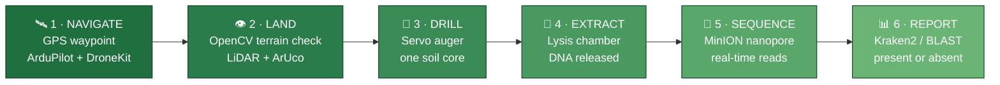
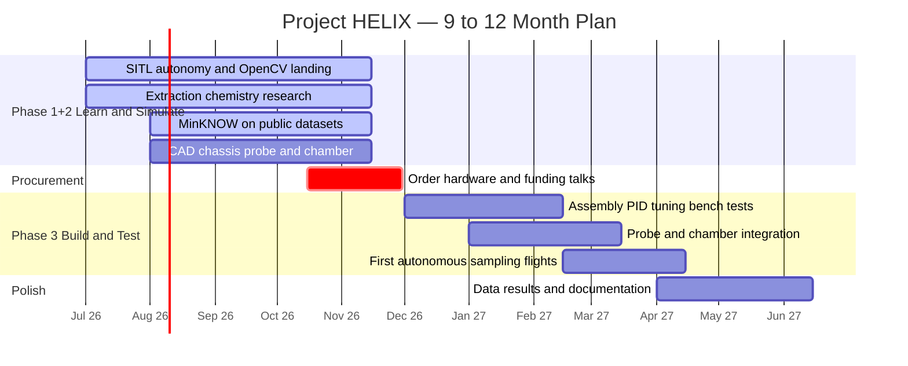

<div align="center">

# 🧬 PROJECT HELIX

### Autonomous eDNA Soil-Sampling & On-Board Species Detection Drone

*Fly to a site. Drill a soil core. Extract the DNA. Sequence it in the field.*
*Know what lives there — before you've walked back to the van.*

<br/>


<br/>


</div>

> [!IMPORTANT]
> **Project pivot — July 2026.** HELIX began as an autonomous *medical delivery* drone. It is now an **environmental DNA (eDNA) sampling and species-detection platform**. The airframe, flight controller, onboard computer, and thermal system carry over. The payload bay, detection stack, and scientific mission are new. YOLO has been removed from the vision stack — landing and terrain vision is **OpenCV only**.

---

## 📖 Contents

- [The Idea](#-the-idea)
- [How a Mission Works](#-how-a-mission-works)
- [Engineering Pillars](#️-engineering-pillars)
- [The Team](#-the-team)
- [Technology Stack](#️-technology-stack)
- [Roadmap](#-roadmap)
- [Honest Risks](#️-honest-risks)
- [Repository Structure](#-repository-structure)
- [Getting Started](#-getting-started)

---

## 🎯 The Idea

> ### *"Fieldwork should not take weeks. Presence should be provable in minutes."*

Every living thing sheds DNA into the soil around it — skin, hair, roots, spores, waste. That trace is called **environmental DNA (eDNA)**, and it is a fingerprint of everything that has recently lived in a place.

Today, answering *"is this species here?"* means a person walking to a site, taking a soil sample, driving it to a lab, and waiting days or weeks for a sequencing result.

**Project HELIX collapses that loop into a single flight.** An autonomous hexacopter navigates to a target coordinate, drills a soil core, lyses the sample to release its DNA, feeds it into an on-board nanopore sequencer, matches the reads against a reference database, and reports whether the target species is present — **without the sample ever leaving the field.**

Built by five post-A-Level students as a full-scope engineering project, spanning flight dynamics to wet-lab chemistry.

---

## 🔄 How a Mission Works



**The sample is held at ~4 °C** by a Peltier thermoelectric cooler from the moment it is drilled — eDNA degrades quickly once it leaves the ground. One soil core per flight, one pre-loaded target species per mission, and a **presence / absence** answer at the end.

---

## ⚙️ Engineering Pillars

<table>
<tr>
<td width="50%" valign="top">

### 🛩️ Flight & Autonomy
GPS waypoint navigation and autonomous landing on unprepared terrain. Vision is used to *verify the ground is safe to land on* — not to identify objects.

**Stack:** ArduPilot · DroneKit · MAVLink · SITL <br/>
**Vision:** OpenCV · ArUco · LiDAR *(no YOLO)*

</td>
<td width="50%" valign="top">

### 🔩 Soil Probe & Mechanism
A servo-driven auger that penetrates soil, captures a clean core, and retracts — while a multi-kilogram aircraft stays stable on uneven ground.

**Topics:** Servo control · Soil mechanics · Fusion 360 CAD · Vibration isolation

</td>
</tr>
<tr>
<td width="50%" valign="top">

### 🧪 Wet-Lab & eDNA Chemistry
The hardest problem in the project. Lysing soil to release DNA, isolating it from inhibitors, and doing it **inside a flying machine** with no technician present.

**Topics:** Lysis chemistry · Contamination control · Cold chain · Reagent cartridges

</td>
<td width="50%" valign="top">

### 🧬 Sequencing & Bioinformatics
Turning raw nanopore signal into a species call: basecalling, quality filtering, and matching reads against a curated reference database.

**Stack:** MinION · MinKNOW · EPI2ME · Biopython · Kraken2 / BLAST+

</td>
</tr>
</table>

---

## 👥 The Team

| Member | Role | Owns |
|:---|:---|:---|
| **Matthews** | Project Lead · Systems & Kinematics | Project management, weekly missions, SITL simulation, kinematics modelling, DroneKit scripting |
| **Jean-Paul** | Lead Programmer · CV & Bioinformatics | Landing/terrain CV (OpenCV), ArduPilot/MAVLink, MinKNOW & EPI2ME pipeline, Kraken2/BLAST species matching |
| **Malick** | Maths & Hardware Lead | Coordinate transforms, 6-DoF dynamics, CAD chassis + soil-probe mechanism, power distribution |
| **David** | Wet-Lab & Payload Engineer | On-board DNA extraction chemistry, lysis chamber design, eDNA cold chain, contamination control |
| **Mustafa** | Wet-Lab & Payload Engineer | Reference species database curation, extraction protocol testing, chamber vibration testing, regulations |

> **How we work:** the team commits 2–4 hrs/week. Each week ships as a **mission** — a goal, the tool for the job, a how-to, and the concept behind it. Learn by doing. Progress is tracked in `progress.md` and on GitHub.

---

## 🛠️ Technology Stack

| Tool | Purpose |
|:---|:---|
| **Python 3.x** | Flight logic, probe/chamber actuation, bioinformatics scripting |
| **ArduPilot / ArduCopter** | Low-level flight stabilisation, failsafes, GPS navigation |
| **ArduPilot SITL** | Software-in-the-loop simulator — fly a virtual drone, no hardware needed |
| **DroneKit-Python + MAVLink** | Autonomous mission scripting; Pi ↔ flight-controller comms |
| **OpenCV** | Terrain assessment and precision-landing vision — **classical CV only** |
| **Oxford Nanopore MinION** | USB DNA sequencer — the heart of the science payload |
| **MinKNOW / EPI2ME** | Nanopore data acquisition and basecalling |
| **Biopython · Kraken2 / BLAST+** | Read processing and species matching against the reference database |
| **Fusion 360 · KiCad** | Chassis, soil probe & lysis chamber CAD; thermal-control PCB |
| **Cube Orange+ · Raspberry Pi 5** | Flight controller (redundant IMUs) and onboard flight computer |

> [!NOTE]
> **The Pi 5 does not do the sequencing.** It runs OpenCV, DroneKit, and the actuators. Nanopore basecalling is far too heavy for it — a **companion laptop or Jetson** runs MinKNOW. This split is a deliberate design decision, not an oversight.

### 🎮 Parallel Visualisation Track

An **Unreal Engine + C++ (AirSim-based)** farmland simulation with probe animation and DNA-marker trigger zones, bridged over WebSocket to an HTML/JS dashboard showing live telemetry, chamber temperature, injected physical faults, and sample reports. This is a **separate skillset** from the Python flight stack — *needs an owner assigned before it starts.*

---

## 📅 Roadmap



**Phase 1+2 is simulation-first** — SITL, Gazebo/AirSim, extraction-chemistry literature, and running MinKNOW/EPI2ME against *public* nanopore datasets. No hardware is needed to start, so nobody is blocked waiting on parts.

---

## ⚠️ Honest Risks

This project is ambitious, and we would rather name the hard problems than pretend they are solved.

| Risk | Reality |
|:---|:---|
| 💰 **MinION cost** | **£800 – £4,500+** for the sequencer alone — this *exceeds the entire original £1,000 budget*. Total project estimate is now **£2,140 – £6,700+**. This needs a funding / sponsorship / university-partnership conversation **before Phase 3.** |
| 🧪 **Extraction chemistry** | The **hardest engineering problem in the project.** Reliable soil lysis and DNA isolation inside a vibrating aircraft, with no technician present, is genuinely unsolved for us. Highest technical risk. |
| ⚖️ **On-board vs. lab** | Sequencing on-board gives a live field result but carries far more risk than flying the sample back to a lab. We chose the harder path deliberately — and it may have to fall back. |
| 🔬 **Contamination** | A single stray skin cell can produce a false positive. Contamination control is a first-class design constraint, not an afterthought. |

---

## 📁 Repository Structure

```
PROJECT-HELIX/
│
├── 01_learning_and_simulation/     # Phase 1 — simulation & research
│   ├── biochemistry/               # eDNA extraction chemistry, lysis, cold chain
│   ├── coding_and_cv/              # OpenCV landing vision + bioinformatics scripts
│   ├── maths_and_kinematics/       # 6-DoF modelling, coordinate transforms
│   ├── cad_designs/                # Fusion 360 — chassis, soil probe, chamber
│   ├── pcb_design/                 # KiCad schematics & Gerber exports
│   └── flight_simulations/         # SITL profiles & autonomous mission scripts
│
├── 02_hardware_and_build/          # Phase 3 — physical hardware
│   ├── flight_controller/          # Cube Orange+ params & firmware configs
│   ├── payload_bay/                # Soil probe, lysis chamber, thermal control
│   └── telemetry_logs/             # Real flight data for performance analysis
│
├── docs/                           # Design specs & research notes
└── Media/                          # Renders, sketches, diagrams, photos
```

---

## 🚀 Getting Started

Phase 1 runs entirely in simulation — **no drone hardware required.**

```bash
# Clone the repository
git clone https://github.com/MatthewsDS/Medical-drone-delivery-Project-.git
cd Medical-drone-delivery-Project-

# Core flight + vision dependencies
pip install opencv-python dronekit pymavlink numpy geopy folium

# Bioinformatics dependencies
pip install biopython
```

```bash
# Launch the SITL virtual drone
sim_vehicle.py -v ArduCopter --console --map

# Run an autonomous mission script
python 01_learning_and_simulation/flight_simulations/autonomous_mission.py
```

> [!TIP]
> **New to the team? Start here.** You don't need to understand the whole system to contribute. Pick up this week's mission — the concept behind it gets explained alongside the task.

---

<div align="center">

<br/>

### 🧬 PROJECT HELIX

**Autonomous eDNA Sampling & Species Detection**

*Post-A-Level STEM engineering project · 2026 – 2027*

<br/>


</div>
